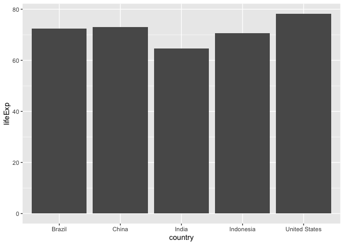

# Class 5
Marina Puffer (A16341339)

\##Using ggplot

The ggplot2 package must be installed as it does not come with R “out of
the box”

Use the `install.packages()` function to do this

``` r
head(cars)
```

      speed dist
    1     4    2
    2     4   10
    3     7    4
    4     7   22
    5     8   16
    6     9   10

To use ggplot, I need to load it up before I can call any of the
functions in the package. I do this with the `library()` function.

``` r
library(ggplot2)
```

All ggplot figures have at least 3 things: 1. data (the stuff we want to
plot) 2. aesthetic mapping (aes values) 3. geoms

``` r
ggplot(cars) + 
  aes(x=speed,y=dist) +
  geom_point()
```


ggplot is not the only graphing system in R, there are many others.
There is even “base R” graphics, which is very simple but tends to be
ugly and requires lots of lines of code to beautify. To make scatter
plots in ggplot2, use geom_point() number of rows (nrow()) = 50 number
of columns (ncol()) = 4

``` r
plot(cars)
```


``` r
nrow(cars)
```

    [1] 50

``` r
ggplot(cars) + 
  aes(x=speed,y=dist) +
  geom_point() +
  geom_smooth(method="lm",se=FALSE) + 
  labs(title="Speed and Stopping Distances of Cars", 
  x="Speed (MPH)", 
  y="Stopping Distance (ft)", 
  subtitle = "Compring speed and stopping distances of cars", 
  caption="Dataset:'cars'") + 
  theme_bw()
```

    `geom_smooth()` using formula = 'y ~ x'


``` r
url <- "https://bioboot.github.io/bimm143_S20/class-material/up_down_expression.txt"
genes <- read.delim(url)
head(genes)
```

            Gene Condition1 Condition2      State
    1      A4GNT -3.6808610 -3.4401355 unchanging
    2       AAAS  4.5479580  4.3864126 unchanging
    3      AASDH  3.7190695  3.4787276 unchanging
    4       AATF  5.0784720  5.0151916 unchanging
    5       AATK  0.4711421  0.5598642 unchanging
    6 AB015752.4 -3.6808610 -3.5921390 unchanging

``` r
nrow(genes)
```

    [1] 5196

``` r
colnames(genes)
```

    [1] "Gene"       "Condition1" "Condition2" "State"     

``` r
ncol(genes)
```

    [1] 4

``` r
table(genes$State)
```


          down unchanging         up 
            72       4997        127 

``` r
round(table(genes$State)/nrow(genes)*100,2)
```


          down unchanging         up 
          1.39      96.17       2.44 

``` r
ggplot(genes) +
  aes(x=Condition1, y=Condition2) +
  geom_point()
```


Add extra information to this through the use of color, and you can
customize the colors by using “scale_colour_manual”

``` r
p <- ggplot(genes) +
  aes(x=Condition1,y=Condition2, col=State) +
  geom_point()
p
```


``` r
p+scale_colour_manual(values=c("blue","grey","red")) +
  labs(title="Gene Expression Changes Upon Drug Treatment",
       x="Control (no drug)",
       y="Drug Treatment")
```


Add labels using the “labs()” function, defining the x and y axes.

``` r
library(gapminder)
library(dplyr)
```


    Attaching package: 'dplyr'

    The following objects are masked from 'package:stats':

        filter, lag

    The following objects are masked from 'package:base':

        intersect, setdiff, setequal, union

``` r
gapminder_2007 <- gapminder%>%filter(year==2007)
```

``` r
library(ggplot2)
```

Installed packages “gapminder” and “dplyr”, make sure to load them using
“library()”

``` r
ggplot(gapminder_2007)+
  aes(x=gdpPercap, y=lifeExp, color=continent, size=pop) +
  geom_point(alpha=0.5)
```


``` r
ggplot(gapminder_2007)+
  aes(x=gdpPercap, y=lifeExp, color=pop) +
  geom_point(alpha=0.4)
```


``` r
ggplot(gapminder_2007)+
  aes(x=gdpPercap, y=lifeExp, size=pop) +
  geom_point(alpha=0.5) +
  scale_size_area(max_size=10)
```


``` r
library(gapminder)
library(dplyr)
gapminder_1957 <- gapminder%>%filter(year==1957)
ggplot(gapminder_1957) +
  aes(x=gdpPercap, y=lifeExp, color=continent, size=pop) +
  geom_point(alpha=0.7) + 
  scale_size_area(max_size=15)
```


``` r
library(gapminder)
library(dplyr)
gapminder_1957 <- gapminder%>%filter(year==1957 | year==2007)
ggplot(gapminder_1957) +
  aes(x=gdpPercap, y=lifeExp, color=continent, size=pop) +
  geom_point(alpha=0.7) + 
  scale_size_area(max_size=10) +
  facet_wrap(~year)
```


``` r
gapminder_top5 <- gapminder %>% 
  filter(year==2007) %>% 
  arrange(desc(pop)) %>% 
  top_n(5, pop)

gapminder_top5
```

    # A tibble: 5 × 6
      country       continent  year lifeExp        pop gdpPercap
      <fct>         <fct>     <int>   <dbl>      <int>     <dbl>
    1 China         Asia       2007    73.0 1318683096     4959.
    2 India         Asia       2007    64.7 1110396331     2452.
    3 United States Americas   2007    78.2  301139947    42952.
    4 Indonesia     Asia       2007    70.6  223547000     3541.
    5 Brazil        Americas   2007    72.4  190010647     9066.

``` r
ggplot(gapminder_top5) +
  geom_col(aes(x=country, y=pop, fill=lifeExp)) 
```


``` r
ggplot(gapminder_top5) + 
  geom_col(aes(x=country,y=lifeExp))
```



``` r
ggplot(gapminder_top5) +
  geom_col(aes(x=reorder(country,-pop), y=pop, fill=country), col="gray30" ) +
  guides(fill="none")
```


``` r
USArrests$State <- rownames(USArrests)
ggplot(USArrests) +
  aes(x=reorder(State,Murder), y=Murder) +
  geom_point() +
  geom_segment(aes(x=State, xend=State, y=0, yend=Murder), color="blue") +
  coord_flip()
```


