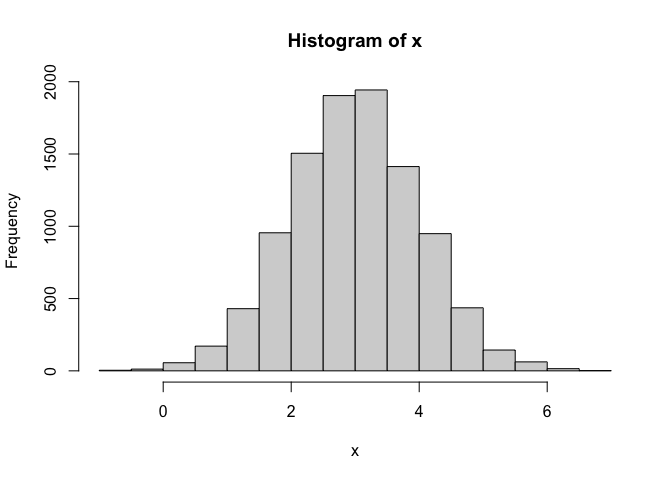
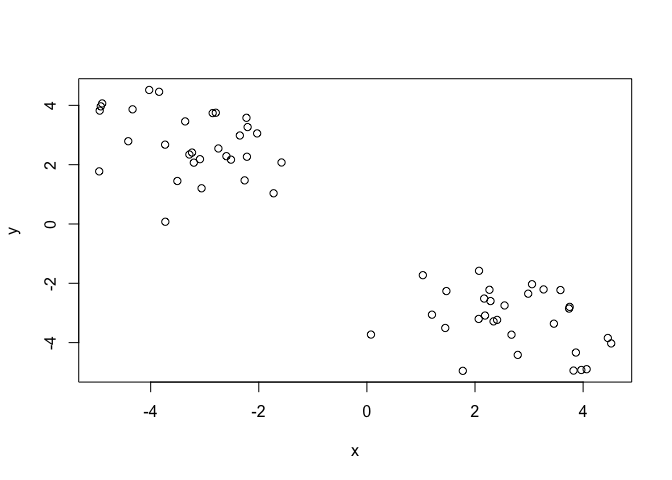
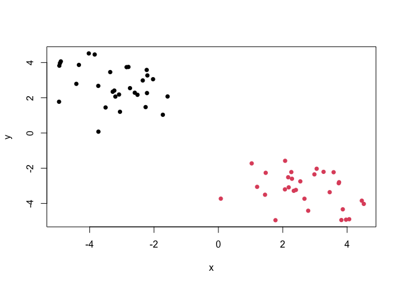
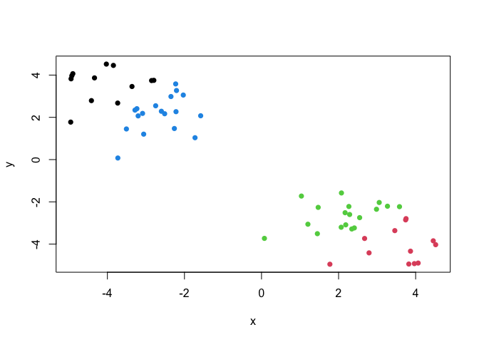
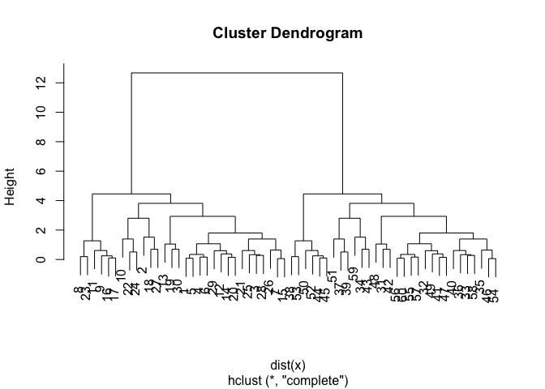
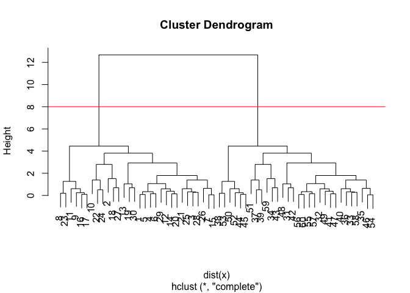
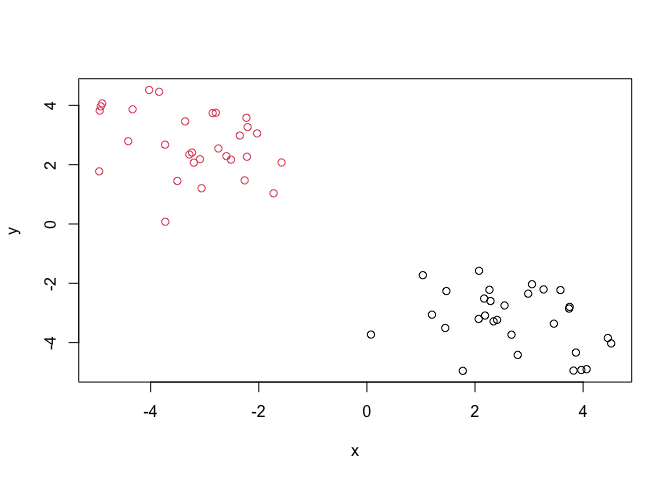
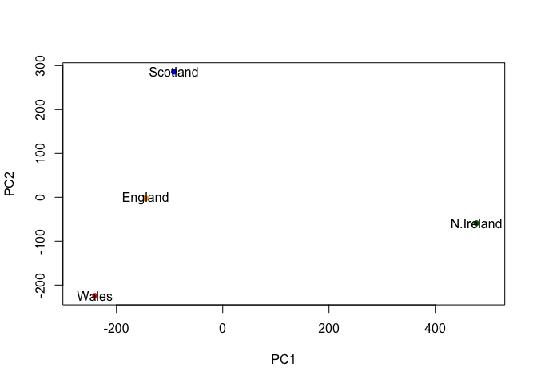

# Class07: Machine Learning 1
Marina Puffer (PID: A16341339)

# Clustering

We will start today’s lab with clusterin methods, in particular
so-called K means. The main function for this in R is `kmeans()`.

Let’s try it on some made up data where we know what the answer should
be.

``` r
x <- rnorm(10000, mean=3)
hist(x)
```



60 points

``` r
tmp <- c(rnorm(30, mean=3), rnorm(30,-3))
x <- cbind(x=tmp, y=rev(tmp))
head(x)
```

                x         y
    [1,] 2.342928 -3.283755
    [2,] 1.774390 -4.951957
    [3,] 3.268611 -2.206403
    [4,] 2.067901 -3.201720
    [5,] 2.408700 -3.234459
    [6,] 2.185760 -3.087529

We can pass this through the base R `plot()` meachanism:

``` r
plot(x)
```



Try `kmeans()` on this data

``` r
k <- kmeans(x, centers=2, nstart=20)
k
```

    K-means clustering with 2 clusters of sizes 30, 30

    Cluster means:
              x         y
    1 -3.221258  2.711992
    2  2.711992 -3.221258

    Clustering vector:
     [1] 2 2 2 2 2 2 2 2 2 2 2 2 2 2 2 2 2 2 2 2 2 2 2 2 2 2 2 2 2 2 1 1 1 1 1 1 1 1
    [39] 1 1 1 1 1 1 1 1 1 1 1 1 1 1 1 1 1 1 1 1 1 1

    Within cluster sum of squares by cluster:
    [1] 62.83246 62.83246
     (between_SS / total_SS =  89.4 %)

    Available components:

    [1] "cluster"      "centers"      "totss"        "withinss"     "tot.withinss"
    [6] "betweenss"    "size"         "iter"         "ifault"      

> Q1: How many points are in each cluster?

``` r
k$size
```

    [1] 30 30

> Q2: Cluster membership?

``` r
k$cluster
```

     [1] 2 2 2 2 2 2 2 2 2 2 2 2 2 2 2 2 2 2 2 2 2 2 2 2 2 2 2 2 2 2 1 1 1 1 1 1 1 1
    [39] 1 1 1 1 1 1 1 1 1 1 1 1 1 1 1 1 1 1 1 1 1 1

> Q3: Cluster centers?

``` r
k$centers
```

              x         y
    1 -3.221258  2.711992
    2  2.711992 -3.221258

> Q4: Plot my clustering results

``` r
plot(x, col=k$cluster, pch=16)
```



> Q5: Cluster the data again into 4 groups and plot the results

``` r
k4 <- kmeans(x, centers=4, nstart=20)
k4$cluster
```

     [1] 3 2 3 3 3 3 2 2 2 3 2 3 3 3 2 2 2 2 3 3 3 3 2 3 3 2 2 3 3 3 4 4 4 1 1 4 4 1
    [39] 4 4 4 4 1 1 1 1 4 4 4 1 4 1 1 1 4 4 4 4 1 4

``` r
plot(x, col=k4$cluster, pch=16)
```



K means is very popular mostly because it is fast and relatively
straightforward to run and understand. It hasa big limitation, you need
to tell it how many groups (k, or centers) you want.

# Hierarchical clustering

Main function in base R is called `hclust()`. You have to pass it in a
“distance matrix”, not just your input data. You can generate a distance
matrix with the `dist()` function.

``` r
hc <- hclust(dist(x))
hc
```


    Call:
    hclust(d = dist(x))

    Cluster method   : complete 
    Distance         : euclidean 
    Number of objects: 60 

``` r
plot(hc)
```



To find the clusters (cluster membership vector) from a `hclust()`
result we can “cut” the tree at a certain height that we like.

``` r
plot(hc)
abline(h=8, col="red") #function to add line at certain `h` height
```



``` r
grps <- cutree(hc,h=8) #gives vector with cluster membership of each value
```

``` r
table(grps) #gives number of values within each cluster
```

    grps
     1  2 
    30 30 

> Q6: Plot our hclust results

``` r
plot(x, col=grps)
```



# PCA of UK Food Data

Read `UK_foods.csv` input file and assigned the data frame as `x`

``` r
url <- "https://tinyurl.com/UK-foods"
x <- read.csv(url)
x
```

                         X England Wales Scotland N.Ireland
    1               Cheese     105   103      103        66
    2        Carcass_meat      245   227      242       267
    3          Other_meat      685   803      750       586
    4                 Fish     147   160      122        93
    5       Fats_and_oils      193   235      184       209
    6               Sugars     156   175      147       139
    7      Fresh_potatoes      720   874      566      1033
    8           Fresh_Veg      253   265      171       143
    9           Other_Veg      488   570      418       355
    10 Processed_potatoes      198   203      220       187
    11      Processed_Veg      360   365      337       334
    12        Fresh_fruit     1102  1137      957       674
    13            Cereals     1472  1582     1462      1494
    14           Beverages      57    73       53        47
    15        Soft_drinks     1374  1256     1572      1506
    16   Alcoholic_drinks      375   475      458       135
    17      Confectionery       54    64       62        41

> Q1. How many rows and columns are in your new data frame named `x`?
> What R functions could you use to answer this question?

``` r
dim(x) #or nrow(x) and ncol(x)
```

    [1] 17  5

We want a table with 4 columns, one for each country, rather than 5.

``` r
rownames(x) <- x[,1] #This sets the rownames to the first column
x <- x[,-1] #removes the first column with -1
head(x)
```

                   England Wales Scotland N.Ireland
    Cheese             105   103      103        66
    Carcass_meat       245   227      242       267
    Other_meat         685   803      750       586
    Fish               147   160      122        93
    Fats_and_oils      193   235      184       209
    Sugars             156   175      147       139

Check dimensions again

``` r
dim(x)
```

    [1] 17  4

Other method: read data file again and set the `row.names` argument of
`read.csv()` to be the first column.

``` r
x <- read.csv(url, row.names=1)
head(x)
```

                   England Wales Scotland N.Ireland
    Cheese             105   103      103        66
    Carcass_meat       245   227      242       267
    Other_meat         685   803      750       586
    Fish               147   160      122        93
    Fats_and_oils      193   235      184       209
    Sugars             156   175      147       139

> Q2. Which approach to solving the ‘row-names problem’ mentioned above
> do you prefer and why? Is one approach more robust than another under
> certain circumstances?

I prefer the second method, it is much simpler and definitively sets the
first column as the row names. The first method requires you to remove
the first column, and if that was run multiple times, would remove
multiple columns.

Barplot of the data:

``` r
barplot(as.matrix(x), beside=T, col=rainbow(nrow(x)))
```


> Q3: Changing what optional argument in the above barplot() function
> results in the following plot?(stacked bar graph)

``` r
barplot(as.matrix(x), col=rainbow(nrow(x))) #removed `beside=T`
```


Removing the argument `beside=T` makes it a stacked bar plot.

> Q5: Generating all pairwise plots may help somewhat. Can you make
> sense of the following code and resulting figure? What does it mean if
> a given point lies on the diagonal for a given plot?

``` r
pairs(x, col=rainbow(10), pch=16)
```


The function `pairs()` produces a matrix of scatterplots. Each of the
scatterplots is a comparison between two countries. For example, the
very top right plot is England vs. N. Ireland. Any points above the
diagonal means that for that category, one of the two countries consumes
more or less of that food. If it lies on the diagonal, both countries
are relatively equal in consumption of that food.

> Q6. What is the main differences between N. Ireland and the other
> countries of the UK in terms of this data-set?

N. Ireland shows variation when compared to all of the other countries.
The green and blue variables, which coorespond to potatoes and fruit,
have the highest amount of variation compared to the other countries.

## Principal Componenet Analysis (PCA)

PCA can help us make sense of these types of datasets. Let’s see how it
works.

The main function in base R is called `prcomp()`. In this case, we want
to first take the transpose of our input `x` so the columns are the food
types and the countries are the rows.

``` r
head(t(x)) #t() transposes data, switches x and y axes
```

              Cheese Carcass_meat  Other_meat  Fish Fats_and_oils  Sugars
    England      105           245         685  147            193    156
    Wales        103           227         803  160            235    175
    Scotland     103           242         750  122            184    147
    N.Ireland     66           267         586   93            209    139
              Fresh_potatoes  Fresh_Veg  Other_Veg  Processed_potatoes 
    England               720        253        488                 198
    Wales                 874        265        570                 203
    Scotland              566        171        418                 220
    N.Ireland            1033        143        355                 187
              Processed_Veg  Fresh_fruit  Cereals  Beverages Soft_drinks 
    England              360         1102     1472        57         1374
    Wales                365         1137     1582        73         1256
    Scotland             337          957     1462        53         1572
    N.Ireland            334          674     1494        47         1506
              Alcoholic_drinks  Confectionery 
    England                 375             54
    Wales                   475             64
    Scotland                458             62
    N.Ireland               135             41

``` r
pca <- prcomp(t(x))
summary(pca)
```

    Importance of components:
                                PC1      PC2      PC3       PC4
    Standard deviation     324.1502 212.7478 73.87622 2.921e-14
    Proportion of Variance   0.6744   0.2905  0.03503 0.000e+00
    Cumulative Proportion    0.6744   0.9650  1.00000 1.000e+00

> Q7. Complete the code below to generate a plot of PC1 vs PC2. The
> second line adds text labels over the data points.

``` r
pca$x
```

                     PC1         PC2        PC3           PC4
    England   -144.99315   -2.532999 105.768945 -9.152022e-15
    Wales     -240.52915 -224.646925 -56.475555  5.560040e-13
    Scotland   -91.86934  286.081786 -44.415495 -6.638419e-13
    N.Ireland  477.39164  -58.901862  -4.877895  1.329771e-13

``` r
plot(pca$x[,1], pca$x[,2], xlab="PC1", ylab="PC2", xlim=c(-270,500))
text(pca$x[,1], pca$x[,2], colnames(x))
```


> Q8. Customize your plot so that the colors of the country names match
> the colors in our UK and Ireland map and table at start of this
> document.

``` r
plot(pca$x[,1], pca$x[,2], col=c("orange", "red", "blue", "darkgreen"), pch=16, xlab="PC1", ylab="PC2", xlim=c(-270,500))
text(pca$x[,1], pca$x[,2], colnames(x))
```



The “loadings” temm us how much the original variables (ex: food)
contribute to the new variables (ex: the PCs)

``` r
head(pca$rotation)
```

                            PC1         PC2         PC3         PC4
    Cheese         -0.056955380  0.01601285  0.02394295 -0.40938259
    Carcass_meat    0.047927628  0.01391582  0.06367111  0.72948192
    Other_meat     -0.258916658 -0.01533114 -0.55384854  0.33100113
    Fish           -0.084414983 -0.05075495  0.03906481  0.02237588
    Fats_and_oils  -0.005193623 -0.09538866 -0.12522257  0.03451216
    Sugars         -0.037620983 -0.04302170 -0.03605745  0.02494334

``` r
par(mar=c(10, 3, 0.35, 0))
barplot( pca$rotation[,1], las=2 )
```


